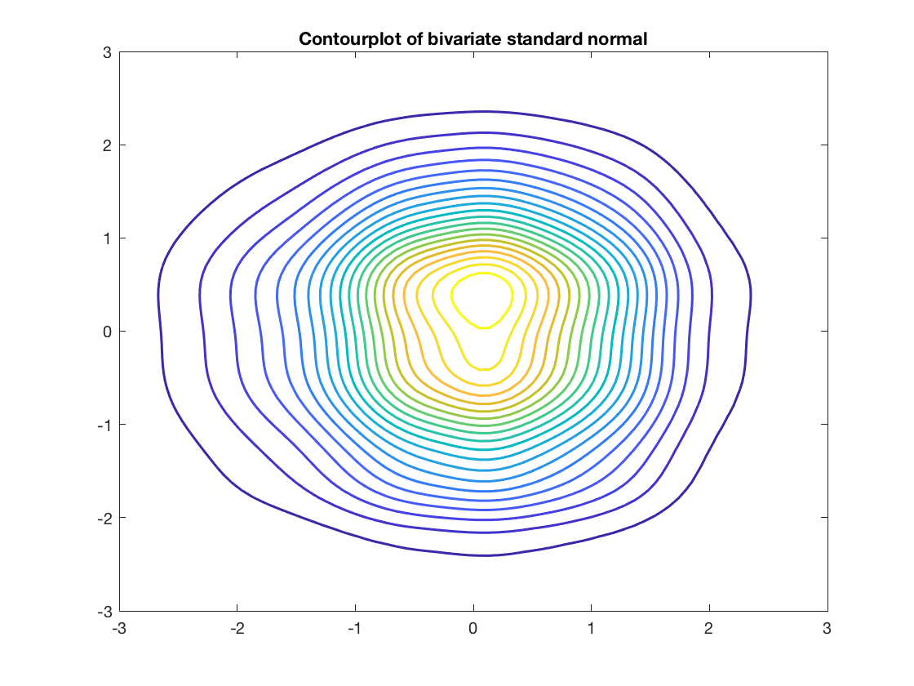
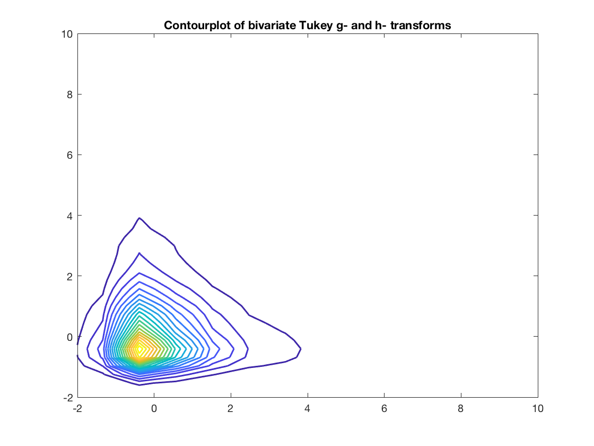
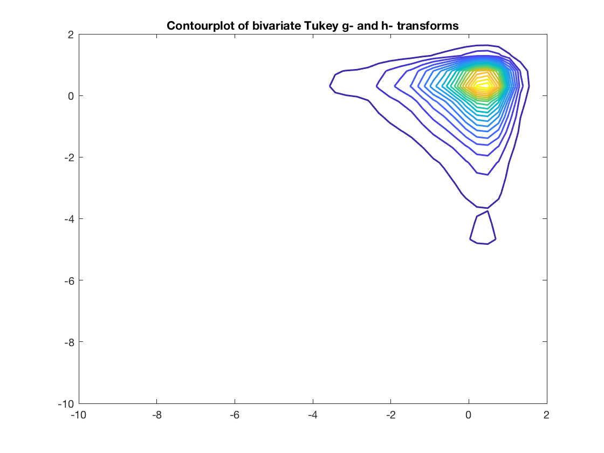

##  **TukeyContour**







```yaml

Name of Quantlet: TukeyContour

Published in: Gitlab

Description: 'Simulates bivariate standard normal sample and plots Tukey transformations with different g and h as contourplot.'

Keywords: 'contourplot, standard normal, Tukey transform, g-h-transform, transformation'

See also: 'TukeyQuantiles, TukeyQQ, TukeyEmpirical'

Author: Awdesch Melzer
```


```Matlab
% clear history
clear all
close all
clc

mu = [0];

x = normrnd(mu,1,1000,2);

h = 1.06*[1 1].* 1000.^(-1/5);

% Compute a kernel density estimates
[f1,xi1] = ksdensity(x(:,1));
[f2,xi2] = ksdensity(x(:,2));

[xxi,yyi] = meshgrid(xi1,xi2);
[ff1,ff2] = meshgrid(f1,f2);
pdfxy = ff1.*ff2;
figure(1)
contour(xxi,yyi,pdfxy,20, 'Linewidth', 1.5)
set(gca, 'XLim',[-3 3])
set(gca, 'YLim',[-3 3])
title('Contourplot of bivariate standard normal' )

% specify values for g and h

g1=0.9;
h1=0.09;

T1=(1/g1).*exp(h1*x.^2/2).*(exp(g1.*x)-1);      

h = 1.06*[1 1].* 1000.^(-1/5);

% Compute a kernel density estimates
[f1,xi1] = ksdensity(T1(:,1));
[f2,xi2] = ksdensity(T1(:,2));

[xxi,yyi] = meshgrid(xi1,xi2);
[ff1,ff2] = meshgrid(f1,f2);
pdfxy = ff1.*ff2;
figure(2)
contour(xxi,yyi,pdfxy,20, 'Linewidth', 1.5)
set(gca, 'XLim',[-2 10])
set(gca, 'YLim',[-2 10])
title('Contourplot of bivariate Tukey g- and h- transforms' )

g2=-0.9;
h2=0.09;

T2=(1/g2).*exp(h2*x.^2/2).*(exp(g2.*x)-1);   

% Compute a kernel density estimates
[f1,xi1] = ksdensity(T2(:,1));
[f2,xi2] = ksdensity(T2(:,2));

[xxi,yyi] = meshgrid(xi1,xi2);
[ff1,ff2] = meshgrid(f1,f2);
pdfxy = ff1.*ff2;
figure(3)
contour(xxi,yyi,pdfxy,20, 'Linewidth', 1.5)
set(gca, 'XLim',[-10 2])
set(gca, 'YLim',[-10 2])
title('Contourplot of bivariate Tukey g- and h- transforms' )

```
